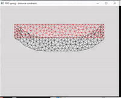

# physics_method_practice
Some popular and fundamental physics methods.\
Used external libraries [glfw](https://www.glfw.org/), [delfem2](https://github.com/nobuyuki83/delfem2)

# Install
1. `git submodule update --init`
2. `cmake -S . -B build` in project folders such as `1_pbd_2D`

## 1_pbd_2D (position based dynamic)

